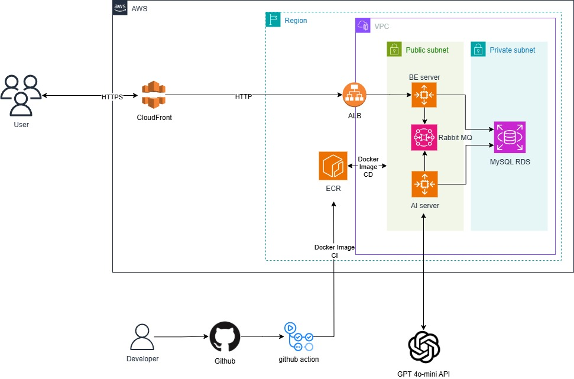

# GeoMemo — 위치 기반 감정 기록 & 인사이트 플랫폼

> **“어디에서 어떤 감정을 느꼈는가?”**  
> 장소·시간과 연결된 감정/메모를 기록하고, **맵/타임라인/리포트**로 시각화하여 **나의 감정 패턴**을 발견합니다. 재방문 시에는 **과거의 나**를 스마트하게 리마인드합니다.
 
> 다운로드 링크: https://github.com/2025-OSS-Project/GeoMemo-Frontend/releases/tag/v1.0.0

  
  
  

---

## 👀 GeoMemo 한눈에 보기

* **기록(Record)**: 위치 태그와 함께 감정·메모(텍스트/태그/사진)를 **순간 저장**
* **시각화(Visualize)**: **지도 히트맵 / 타임라인 / 캘린더**로 감정의 **시간·공간 패턴** 탐색
* **인사이트(Insight)**: 장소별 감정 분포·키워드·추세를 **자동 분석**
* **리마인드(Remind)**: **재방문 감지** 시 과거 기록과 제안(예: 호흡/산책/메모 리추얼)
* **리포트(Report)**: 일·주·월 **감정 리포트**로 스스로를 리뷰
* **프라이버시(Privacy)**: 로컬 암호화/좌표 격자화/데이터 내보내기·삭제 지원

---

## 💡 왜 GeoMemo 인가?

* 감정은 **상황과 장소**에 깊게 묶여 있습니다. GeoMemo는 **컨텍스트(위치×시간)**와 함께 저장해 **의미 있는 패턴**을 드러냅니다.
* “이 카페에서 자주 불안을 느낀다” 같은 **자각**은 **루틴 개선**과 **스트레스 관리**로 이어집니다.
* 시간에 따라 쌓이는 데이터로 **나만의 웰빙·생산성 지표**를 만들 수 있습니다.

---

## 🎯 주요 사용자 시나리오

* **웰빙/마음챙김**: 출퇴근 경로, 즐겨 찾는 카페/공원에서의 감정 흐름을 주간 리포트로 확인
* **러닝/생산성**: 공부/업무 공간별 몰입도·감정 변화를 추적하고 루틴 최적화
* **여행/일상 기록**: 여행지·동네 산책 등 장소 중심의 감정 다이어리

---

## 🔎 핵심 기능(Feature-centric)

### 1) 감정·메모 기록
* 위치 자동 태깅, 감정 선택(이모지/스케일), 텍스트/사진 첨부
* 오프라인 기록 후 **온라인 동기화**

### 2) 시각화 대시보드
* **맵 히트맵**: 감정 강도의 공간 분포
* **타임라인/캘린더**: 시간 흐름에 따른 변동
* **장소 카드**: 상위 장소/키워드/대표 감정 요약

### 3) 인사이트 & 추천
* **장소 클러스터링**(유사 장소 묶음)과 감정 분포 분석
* 반복 패턴/특이값 감지(예: 특정 요일·시간대의 변동)

### 4) 재방문 리마인드
* 지오펜싱/최근 위치 이벤트 기반 **자동 리마인드**
* 최근 n회 방문 요약 + 미니 제안(메모, 루틴, 휴식 팁 등)

### 5) 리포트
* 일·주·월 단위 **자동 리포트** (추세/하이라이트/추천 루틴)

### 6) 프라이버시 & 데이터 권리
* 좌표 **격자화/익명화** 옵션
* **내보내기/완전 삭제** 제공 (내 데이터의 **소유권** 보장)

---

## 🗺️ 프로젝트 맵(빠른 이동)

* **모바일 앱(Frontend)** — Expo/React Native 기반  
  → [GeoMemo-Frontend](https://github.com/2025-OSS-Project/GeoMemo-Frontend)
* **API 서버(Backend)** — FastAPI 기반, 인증/CRUD/리포트  
  → [GeoMemo-Backend](https://github.com/2025-OSS-Project/GeoMemo-Backend)
* **AI 분석(AI)** — 감정 분류·키워드·클러스터링  
  → [GeoMemo-AI](https://github.com/2025-OSS-Project/GeoMemo-AI)

| 영역       | 설명                   | 바로가기 |
|-----------|------------------------|---------|
| Frontend  | 기록/시각화 모바일 앱  | [🔗 GeoMemo-Frontend](https://github.com/2025-OSS-Project/GeoMemo-Frontend) |
| Backend   | REST API, 인증, 리포트 | [🔗 GeoMemo-Backend](https://github.com/2025-OSS-Project/GeoMemo-Backend)  |
| AI        | 감정 분석·추천 모듈    | [🔗 GeoMemo-AI](https://github.com/2025-OSS-Project/GeoMemo-AI)            |

---

## 🧭 사용 방법(개요)

1. **앱 설치/실행** → 위치 권한 및 알림 설정  
2. **첫 기록 남기기** → 감정 선택 + 메모/사진  
3. **대시보드 열기** → 맵/타임라인/캘린더로 패턴 확인  
4. **리포트 받아보기** → 일·주·월 요약 리포트  
5. **재방문 리마인드** → 과거 기록과 제안 확인

> 상세 설치/실행은 각 레포의 README를 참고하세요.
---

## 🤝 아키텍처 설계도

---

## 🔐 개인정보·보안

* 데이터는 사용자 통제 하에 있습니다.  
* 익명화/격자화/내보내기/완전 삭제를 지원합니다.  
* 취약점 제보는 Security Policy 또는 보안 메일로 부탁드립니다.
